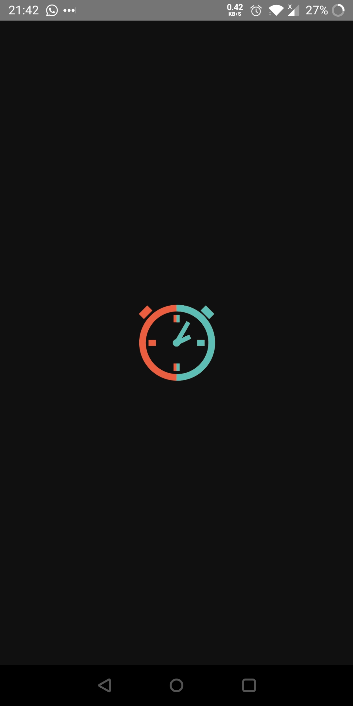
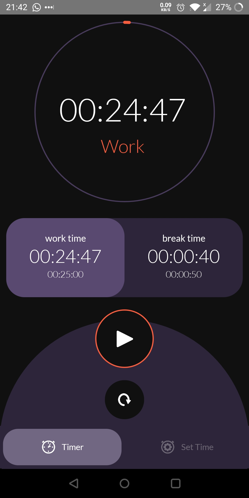
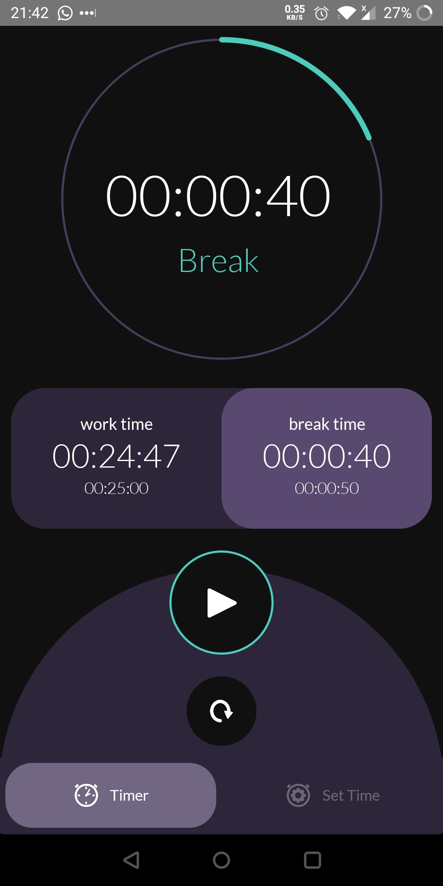
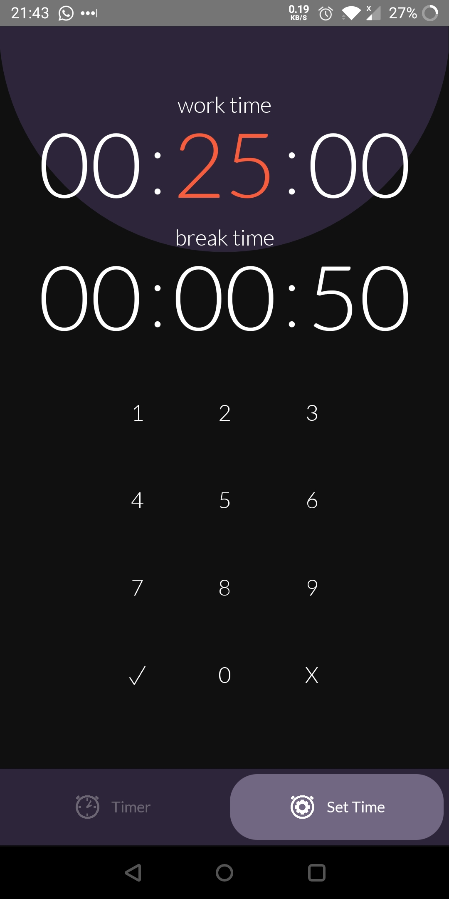

# Workaholic
Work timer app.

## To Run

Clone repository and run:

`npm run android`

Requires either an Android Studio emulator or a phone with USB debugging enabled and connected to your computer.

## Screenshots

| Splash Screen | Work Timer | Break Timer | Time Settings |
| ----- | ----- | ----- | ----- |
|  |  |  |  |
